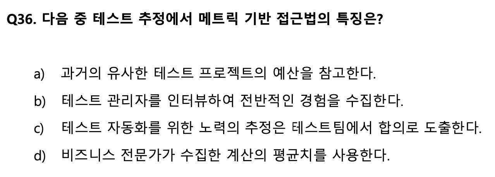

# QA

### QA

- Quality Assurance: 품질 보증
- 프로젝트 전반의 품질 저하 요소를 발견하여 품질을 끌어올림
- 기획, 개발, 프로세스 등을 검수하여 품질 규격과 요구사항 명세를 준수하도록 하는 프로세스
    
    ![[그림 1] Process-level integration of Dynamic Test Processes, ISO/IEC/IEEE 29119-2:2013](./QA/Untitled4.png)
    
    [그림 1] Process-level integration of Dynamic Test Processes, ISO/IEC/IEEE 29119-2:2013
    

### QA Plan

- **테스트를 하기 위해 필요한 리소스들을 요약해놓은 문서**
- **QA가 정해진 프로세스대로 업무를 수행하기 위한 청사진 역할**

이 안에서 테스트의 명확한 기준을 세워 원하는 방향으로 테스트가 진행될 수 있도록 하며, 테스트를 수행하는 도중 변경되기도 하는 등 지속적으로 관리됨

### Test Case, Test Scenario, Test

- [테스트 시나리오(Test Scenario)](https://istqb-glossary.page/test-scenario/)는 테스트 실행을 위한 일련의 활동을 구체적으로 기술해둔 문서입니다. 테스트 시나리오는 「테스트 스크립트」라고 불리기도 하며, 혹은 「수동 테스트 스크립트」라고 부르기도 합니다.
- [테스트 케이스(Test Case)](https://istqb-glossary.page/test-case/)는 「프로그램의 특정 경로를 실험」해보거나 혹은 「프로그램이 특정 요구 사항을 준수하는지를 확인」하기 위한 목적으로 사용합니다. 이 때, 「특정 목적」 또는 「테스트 조건의 확인」을 위해 개발된 「입력 값, 실행 사전 조건, 예상 결과 및 실행 사후 조건」 등을 포함은 내용의 집합을 테스트 케이스라고 합니다.
- 여기에서 하나 더 짚어야 하는 용어가 있습니다. 바로 Test라는 용어입니다. ISTQB Glossary에서는 Test에 대해 다음과 같이 정의하고 있습니다. [테스트(Test)](https://istqb-glossary.page/test/)란 한 개 이상의 테스트 케이스의 집합을 의미합니다.


테스트 케이스 예시

### Bug Report

```
[버그리포트 제목]

- 발생 환경(os 버전, 앱/웹 버전, 서버)
- 재현율
- 이슈 설명
- 사전 조건
- 재현 절차
- 예상 결과
- 실제 결과
- 담당 부서
- 우선순위/심각도
- 발생 버전/수정 버전
- 이슈 카테고리
- 첨부파일
```

### 자질

- 개발
    - 테스트 자동화(UI 테스트, API 테스트)
- 도구
    - 테스팅 도구
    - 이슈(버그) 추적 관리 도구
- 커뮤니케이션
    - 문서 작성 및 관리
    - QA - 기획자
    - QA - 개발자
- 용어 및 프로세스
    - ISTQB
        
        
        
        
        
    
    - 기업 기술 블로그

### 출처

- [https://tech.socarcorp.kr/qa/2022/03/18/probationary-period_QA.html](https://tech.socarcorp.kr/qa/2022/03/18/probationary-period_QA.html)
- [https://softwaretestingreference.tistory.com/221](https://softwaretestingreference.tistory.com/221)
- [https://tech.kakaoenterprise.com/104](https://tech.kakaoenterprise.com/104)
